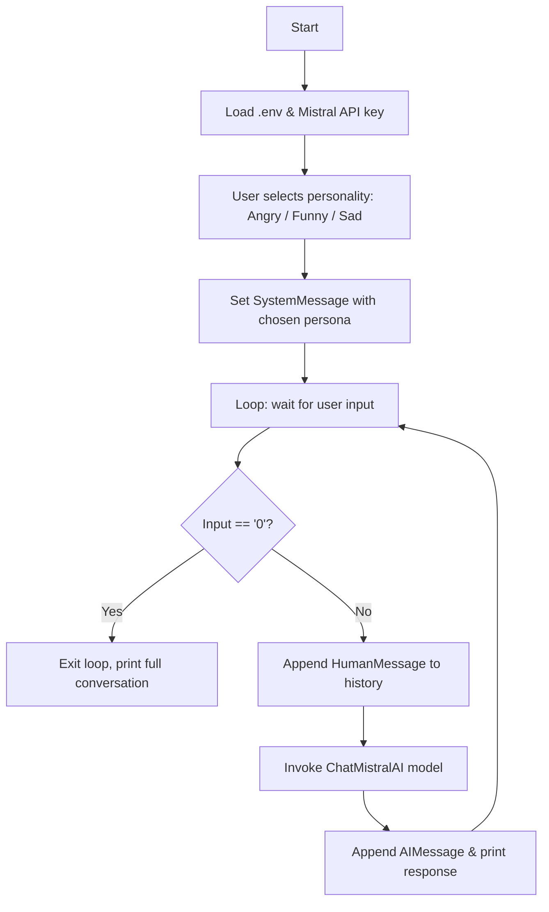
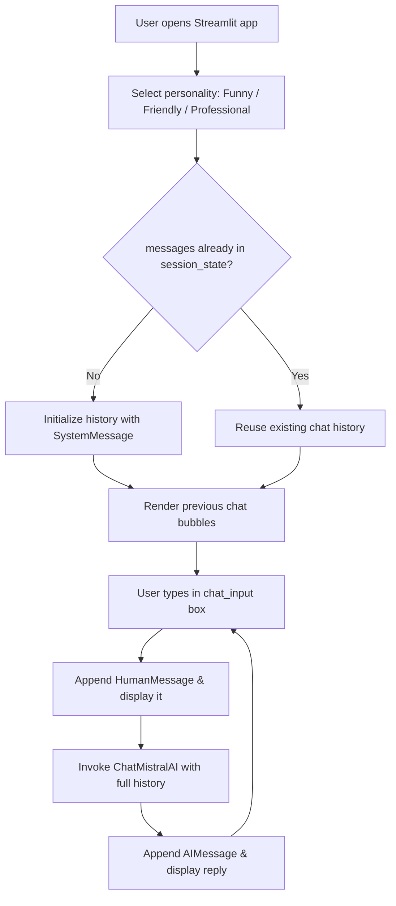

# 🤖 AI Persona Chatbot

A conversational chatbot built with **LangChain** and **Mistral AI** that lets you talk to an AI with a chosen personality. This project contains **two versions of the same idea**:

| File | Type | Description |
|---|---|---|
| `chatBot.py` | 🖥️ Raw / CLI version | Runs in your terminal. You pick a personality, then chat in a loop. |
| `UIchatBot.py` | 🌐 UI version | A Streamlit web app with a personality selector and a proper chat interface. |

---

## ✨ Features

- Powered by `ChatMistralAI` (`mistral-small-2506`) via `langchain-mistralai`
- Personality-driven `SystemMessage` that shapes the AI's tone
- Full conversation history kept in memory for context-aware replies
- Two ways to use it: quick terminal script, or a polished Streamlit UI

**Personality options:**

| CLI (`chatBot.py`) | UI (`UIchatBot.py`) |
|---|---|
| 1 — Angry | Funny |
| 2 — Funny | Friendly |
| 3 — Sad | Professional |

> ⚠️ **Note:** The CLI and UI currently offer *different* persona sets. If you want a consistent experience across both, consider unifying the options (see [Known Limitations](#-known-limitations--ideas-for-improvement)).

---

## 🧠 Tech Stack

- Python 3.9+
- [LangChain](https://python.langchain.com/) (`langchain-core`)
- [langchain-mistralai](https://pypi.org/project/langchain-mistralai/)
- [Streamlit](https://streamlit.io/) (UI version only)
- [python-dotenv](https://pypi.org/project/python-dotenv/) for API key management

---

## 🔀 How It Works

### CLI version (`chatBot.py`)



### UI version (`UIchatBot.py`)



---

## 📦 Installation

```bash
# 1. Clone the repo (if not already done)
git clone https://github.com/<your-username>/<your-repo>.git
cd <your-repo>/ai-persona-chatbot

# 2. Create and activate a virtual environment
python -m venv venv
source venv/bin/activate        # On Windows: venv\Scripts\activate

# 3. Install dependencies
pip install -r requirements.txt
```

## 🔑 Environment Setup

Create a `.env` file in this folder with your Mistral API key:

```
MISTRAL_API_KEY=your_mistral_api_key_here
```

---

## 🚀 Usage

### Run the CLI version

```bash
python chatBot.py
```

You'll be asked to choose a personality (1/2/3), then you can start chatting. Type `0` to exit.

### Run the UI version

```bash
streamlit run UIchatBot.py
```

This opens a browser tab where you can pick a personality and chat in a familiar chat-bubble interface.

---

## ⚠️ Known Limitations / Ideas for Improvement

- **Mismatched personas:** CLI offers Angry/Funny/Sad, UI offers Funny/Friendly/Professional — unify these for consistency.
- **No input validation on CLI:** entering anything other than `1`, `2`, or `3` will crash with a `NameError` since `mode` won't be set. Consider adding a default/else branch.
- **Persona is locked in per UI session:** since the system message is only set once (`if "messages" not in st.session_state`), switching the radio button mid-conversation won't change the AI's behavior until the app is restarted/session cleared. Consider resetting `st.session_state.messages` when personality changes.
- **No streaming responses:** replies appear all at once; `model.stream()` could be used for a more "live typing" feel.
- **No error handling** around the API call (e.g., network errors, rate limits).

---

## 📄 License

Add your preferred license here (e.g., MIT).
