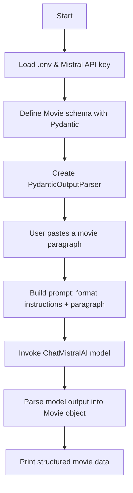
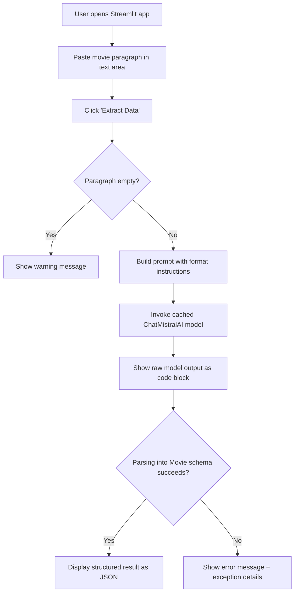

# 🎬 Movie Info Extractor

An AI-powered tool that reads a free-text paragraph describing a movie and converts it into **structured data** (title, year, genre, director, cast, rating, summary) using **LangChain**, **Mistral AI**, and **Pydantic**. This project contains **two versions of the same idea**:

| File | Type | Description |
|---|---|---|
| `clus.py` | 🖥️ Raw / CLI version | Runs in your terminal. Paste a paragraph, get structured output printed back. |
| `UIclus.py` | 🌐 UI version | A Streamlit web app with a text box, an "Extract Data" button, and a nicely rendered JSON result. |

---

## ✨ Features

- Structured extraction using `PydanticOutputParser` — no manual regex/parsing needed
- Defines a strict `Movie` schema so output is predictable and typed
- UI version shows both the **raw model output** and the **parsed structured JSON**
- UI version caches the model with `@st.cache_resource` so it isn't recreated on every rerun
- Graceful error handling in the UI when the model doesn't follow the schema (CLI version does not currently handle this — see [Known Limitations](#-known-limitations--ideas-for-improvement))

### `Movie` schema

```python
class Movie(BaseModel):
    title: str
    release_year: Optional[int]
    genre: List[str]
    director: Optional[str]
    cast: List[str]
    rating: Optional[float]
    summary: str
```

---

## 🧠 Tech Stack

- Python 3.9+
- [LangChain](https://python.langchain.com/) (`langchain-core`)
- [langchain-mistralai](https://pypi.org/project/langchain-mistralai/)
- [Pydantic](https://docs.pydantic.dev/) for schema definition & parsing
- [Streamlit](https://streamlit.io/) (UI version only)
- [python-dotenv](https://pypi.org/project/python-dotenv/) for API key management

---

## 🔀 How It Works

### CLI version (`clus.py`)



### UI version (`UIclus.py`)



---

## 📦 Installation

```bash
# 1. Clone the repo (if not already done)
git clone https://github.com/<your-username>/<your-repo>.git
cd <your-repo>/movie-info-extractor

# 2. Create and activate a virtual environment
python -m venv venv
source venv/bin/activate        # On Windows: venv\Scripts\activate

# 3. Install dependencies
pip install -r requirements.txt
```

## 🔑 Environment Setup

Create a `.env` file in this folder with your Mistral API key:

```
MISTRAL_API_KEY=your_mistral_api_key_here
```

---

## 🚀 Usage

### Run the CLI version

```bash
python clus.py
```

Paste a paragraph describing a movie when prompted, and the structured `Movie` object will be printed to the terminal.

### Run the UI version

```bash
streamlit run UIclus.py
```

Paste your paragraph into the text box, click **Extract Data**, and view both the raw model response and the structured JSON output.

### Example input

```
Inception (2010) is a sci-fi thriller directed by Christopher Nolan, starring
Leonardo DiCaprio, Joseph Gordon-Levitt, and Elliot Page. It follows a thief
who steals secrets through dream-sharing technology. The film has a rating
of 8.8 and blends action with mind-bending storytelling.
```

---

## ⚠️ Known Limitations / Ideas for Improvement

- **No error handling in the CLI version:** if the model's output doesn't match the `Movie` schema, `parser.parse()` will raise an unhandled exception and crash the script (the UI version already wraps this in a `try/except`).
- **No input validation on the CLI** for empty paragraphs (the UI version already checks for this).
- **Model creation isn't cached in the CLI version** — not an issue for a single run, but worth noting if extended into a loop.
- Consider adding a **retry mechanism** (e.g., `OutputFixingParser`) so minor formatting mistakes by the model don't cause a hard failure.

---

